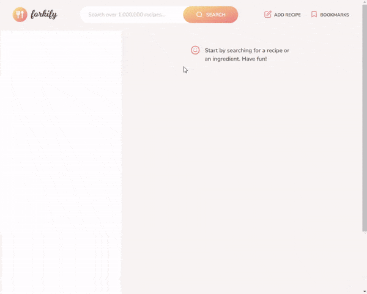
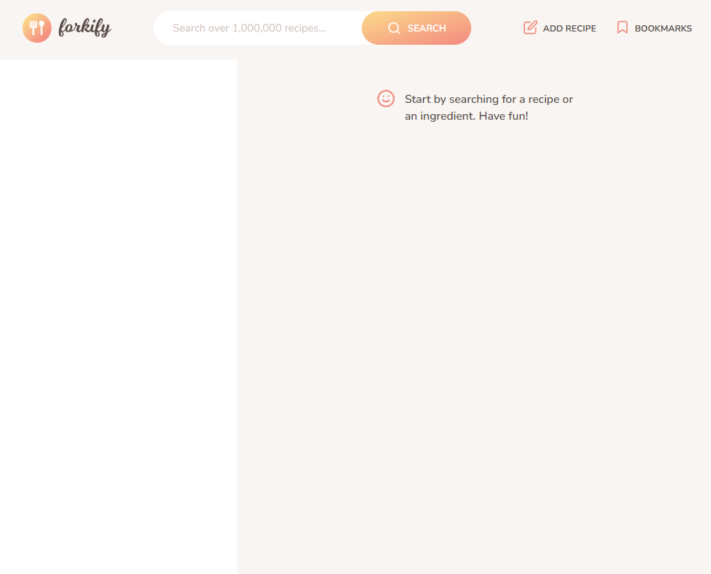
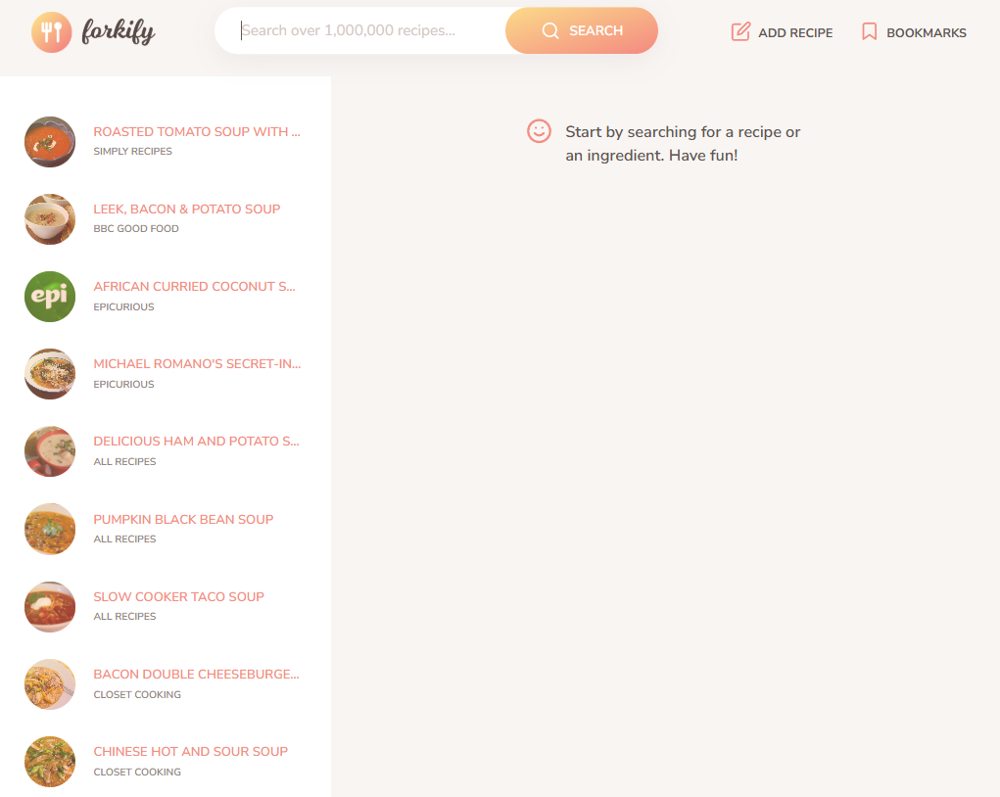
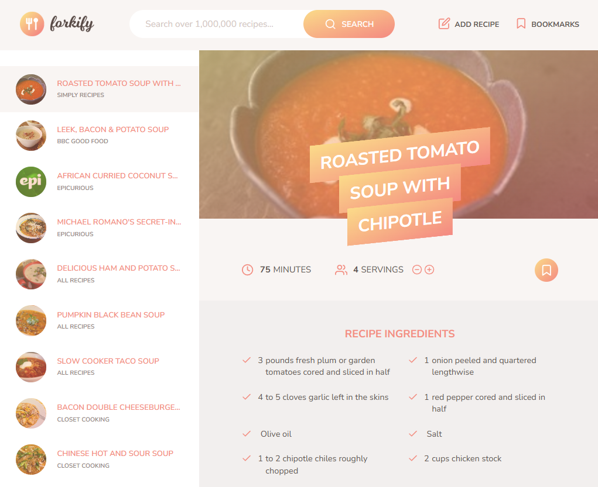
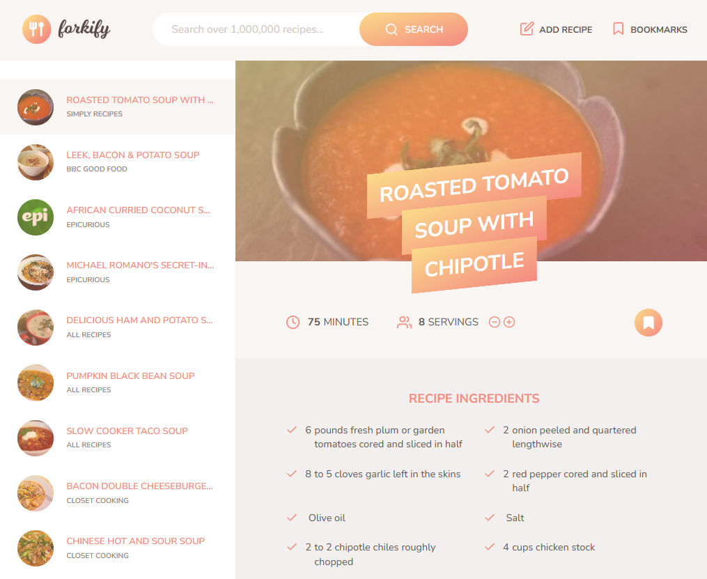
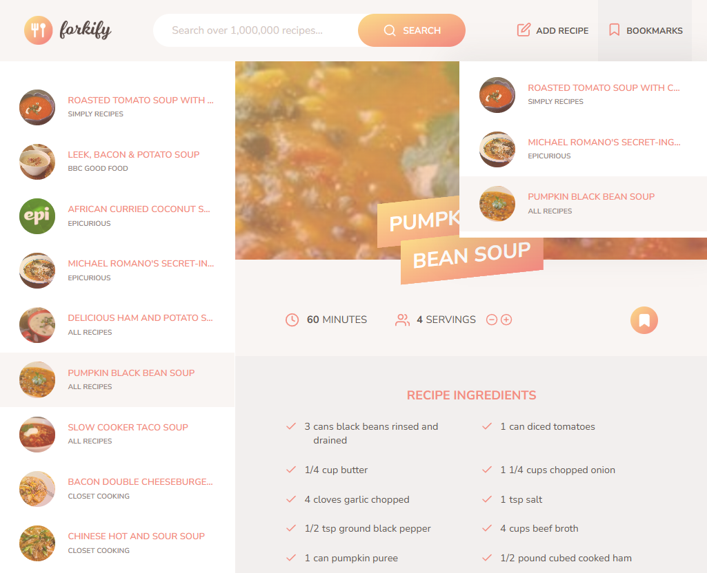

# 🍴 Forkify App

The **Forkify App** is a JavaScript-based application that allows users to search for recipes from a vast database, view detailed cooking instructions, save their favorite recipes as bookmarks, and even upload their own custom recipes. It combines responsive UI, efficient state management, and interactive features to provide an enjoyable cooking experience.



---

## 🚀 Features

### **1. Recipe Search**
- Search over 1,000,000 recipes by ingredient or dish name.
- Display search results with recipe titles, publishers, and preview images.

### **2. Recipe Details**
- View detailed information about a selected recipe, including:
  - Ingredients with quantities and units.
  - Cooking time and serving size.
  - External link to full preparation instructions.

### **3. Bookmarks**
- Save favorite recipes to a personal bookmarks list.
- Manage bookmarks with real-time updates to the UI.
- Bookmarks persist across sessions using `localStorage`.

### **4. Pagination**
- Navigate through search results with dynamic pagination.
- Quickly switch between pages to explore more recipes.

### **5. Adjust Servings**
- Dynamically adjust the number of servings.
- Automatically update ingredient quantities based on servings.

### **6. Upload Recipes**
- Add custom recipes by uploading ingredients, cooking time, and preparation steps.
- Newly uploaded recipes are immediately displayed and can be bookmarked.

### **7. Responsive UI**
- Smooth user interactions with loading spinners, error messages, and modals.
- Optimized for usability on both desktop and mobile devices.

---

## 🛠️ Technologies Used

- **HTML5**: Semantic structure for the app's layout.
- **Sass (CSS Preprocessor)**: Efficient and modular styling.
- **JavaScript (ES6+)**: 
  - Module-based architecture.
  - `async/await` for asynchronous operations.
  - State management with a centralized model.
- **Parcel.js**: Module bundler for optimized development and production builds.
- **Third-party Libraries**: 
  - `fractional` for ingredient quantity formatting.
  - `core-js` and `regenerator-runtime` for polyfilling.

---


## 📖 What I Learned

This project provided insights into modern JavaScript application development, including:

1. **State Management**:
   - Centralized application state in `model.js` for efficient data handling.
   - Used `localStorage` to persist bookmarks across sessions.

2. **Asynchronous Programming**:
   - Handled API requests using `async/await` and the Fetch API.
   - Implemented error handling for failed network requests.

3. **Component-Based Design**:
   - Developed modular and reusable view components for a scalable architecture.

4. **Responsive UI**:
   - Utilized `Sass` for modular and maintainable styles.
   - Implemented user feedback mechanisms like spinners, error messages, and animations.

5. **Pagination and Navigation**:
   - Managed search results with a dynamic pagination system.
   - Enabled hash-based routing for deep linking to recipes.

6. **Upload Functionality**:
   - Allowed users to add and upload recipes with real-time updates to the UI and state.

7. **Build Tools**:
   - Used `Parcel.js` for bundling, live development server, and optimized production builds.

---

## 🌟 Future Improvements

- **User Accounts**:
  - Enable user authentication for personal recipe management.

- **Advanced Filters**:
  - Add filters for dietary preferences, cooking time, and difficulty level.

- **Offline Mode**:
  - Cache recipes for offline access using service workers.

- **Mobile Enhancements**:
  - Further optimize UI for small screens and touch interactions.

---

## 🧑‍💻 Getting Started

### Prerequisites
- Node.js installed on your local machine.

### Installation
1. Clone the repository:
   ```bash
   git clone https://github.com/your-username/forkify.git
   ```
2. Navigate to the project directory:
   ```bash
   cd forkify-recipe-app
   ```
3. Install dependencies:
   ```bash
   npm install
   ```
4. Start the development server:
   ```bash
   npm start
   ```

---

## 📷 Screenshots












---

## 📝 License


This project is based on the coursework and tasks provided in the [Jonas Schmedtmann](https://codingheroes.io/) course titled *"The Complete JavaScript Course 2023: From Zero to Expert!
"* (available on Udemy). The course materials, including designs, flowcharts, and assets, remain the intellectual property of Jonas Schmedtmann.

The implementation, including all code, solutions, and modifications in this repository, was written independently by me as part of my learning journey. This repository is intended solely for educational and portfolio purposes.

If you are interested in the original course materials or would like to support the instructor, please visit [Jonas Schmedtmann's website](https://codingheroes.io/) or his [Udemy profile](https://www.udemy.com/user/jonasschmedtmann/).

---

Enjoy discovering and cooking recipes with Forkify! 🥘
